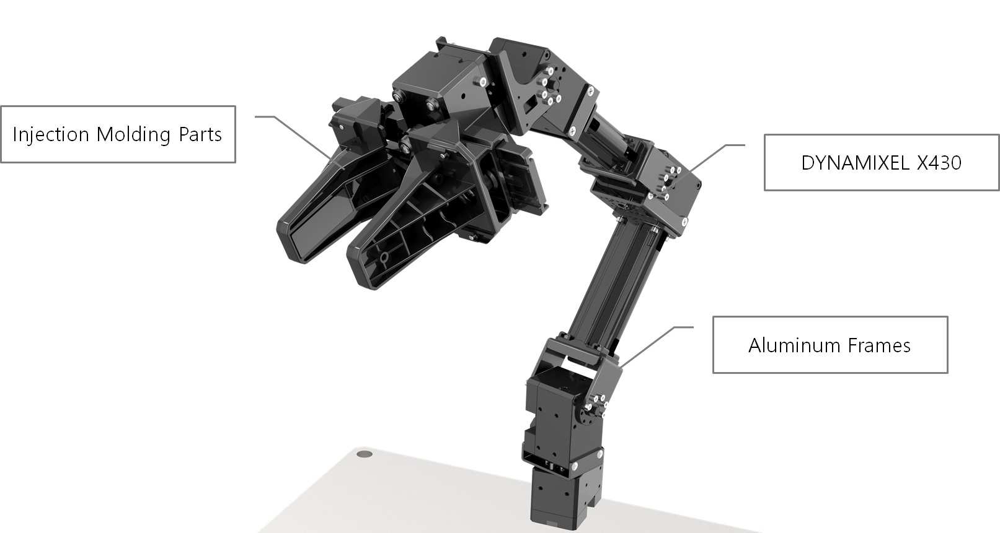
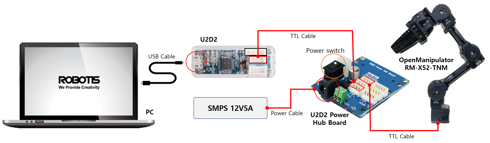

# open_manipulator_x_tutorial
본 리포지토리는 Open Manipulator X의 ROS2 연습용 리포지토리입니다.


## __1. 개발환경__
* [Ubuntu 18.04 LTS](https://ubuntu.com/)
* [ROS2 Dashing](https://docs.ros.org/en/dashing/index.html)
* [Robotis Open Manipulator X](https://emanual.robotis.com/docs/en/platform/openmanipulator_x/overview/#opensoftware)
* Python 3.6

## __2. 노드 소개__
* [__hello_ros_pub__](https://github.com/jungsuyun/open_manipulator_x_tutorial#4-hello_ros_pub) : Python 기반의 ROS2 Topic Publishing 예제
* [__hello_ros_sub__](https://github.com/jungsuyun/open_manipulator_x_tutorial#5-hello_ros_sub) : Python 기반의 ROS2 Topic Subscribing 예제
* [__init_and_home__](https://github.com/jungsuyun/open_manipulator_x_tutorial#6-init_and_home) : 초기 위치, home 위치로 이동하기
* [__gripper_control__](https://github.com/jungsuyun/open_manipulator_x_tutorial#7-gripper_control) : Gripper 열고 닫기
* __jointstate_subscriber__ : 각 Joint별 각속도 값 읽어오기
* __kinematics_subscriber__ : Gripper를 기준으로 현재 위치를 X/Y/Z축 좌표값으로 읽어오기
* __joint_teleoperation__ : Joint 기반의 이동 명령 내리기
* __kinematics_teleoperation__ : X/Y/Z 좌표값 기반의 이동 명령 내리기

## __3. 개발환경 세팅하기__
### __3.1. Open Manipulator 패키지 설치하기__
가장 먼저 ros dashing의 python 패키지와 rqt 관련 패키지를 설치한다.
```bash
sudo apt install ros-dashing-python* ros-dashing-rqt*
```

다음으로 open mainpulator와 관련된 의존성 패키지들을 다운로드 및 빌드를 수행한다.
```bash
cd ~/colcon_ws/src
git clone -b ros2 https://github.com/ROBOTIS-GIT/DynamixelSDK.git  
git clone -b ros2 https://github.com/ROBOTIS-GIT/dynamixel-workbench.git  
git clone -b ros2 https://github.com/ROBOTIS-GIT/open_manipulator.git  
git clone -b ros2 https://github.com/ROBOTIS-GIT/open_manipulator_msgs.git  
git clone -b ros2 https://github.com/ROBOTIS-GIT/open_manipulator_dependencies.git  
git clone -b ros2 https://github.com/ROBOTIS-GIT/robotis_manipulator.git  
cd ~/colcon_ws && colcon build --symlink-install
```

### __3.2. USB Latency Timer Setting__
Ubuntu 환경에서 USB의 지연시간은 기본적으로 16ms로 설정되어 있다. 하지만 Open Manipulator X에 설치되어 있는 DYNAMIXEL과 PC의 통신 실시간성을 보장하기 위해 지연시간을 1ms로 설정하는 노드를 실행한다.
```bash
ros2 run open_manipulator_x_controller create_udev_rules
```

### __3.3. Hardware 구성하기__
U2D2와 PC를 Micro USB로 연결한 후 U2D2의 TTL포트와 U2D2 Power Hub Board의 TTL 파트를 연결한다. 그리고 나머지 포트와 Open Manipulator를 연결한다.


### __3.4. Python 의존성 패키지 설치하기__
다양한 key값을 받아올 수 있도록 우리는 getkey()라는 함수가 필요하다. 이는 Windows의 C++ 코드에는 구현되어 있지만, Ubuntu Linux에는 구현되어 있지 않다. 이를 위해 우리는 getkey()와 관련된 python 패키지를 설치해준다.
```bash
pip3 install getkey
```

## __4. hello_ros_pub__
본 패키지는 ROS2 기반의 프로그래밍 개발을 위해 가볍게 코드를 구현해보자는 의미에서 만든 패키지이다.
### 4.1. 노드 동작 Process

### 4.2. Source code 설명
가장 먼저 의존성 패키지들을 import 해준다. ROS2 기반의 python 프로그래밍을 위해선 `rclpy` 패키지를 import 해주어야 한다. 또한 `String` 타입의 메시지를 발행하기 위해 `std_msgs/msg/String` 타입을 import 해준다.

```python
#!/usr/bin/env python3

import rclpy
from rclpy.node import Node

from std_msgs.msg import String
```

다음으로 클래스 선언 부분이다. 우리는 SimplePublisher라는 클래스를 새로 생성할 것이고 해당 클래스는 `rclpy.node`를 상속받게된다. 가장 먼저 부모 클래스의 `__init__` 함수를 통해 해당 Node 명을 선언해주고 `talker`라는 topic을 발행할 publisher를 선언해준다. 해당 topic은 `timer_callback` 함수를 통해 0.5초마다 반복 실행 될 것이다.
```python
class SimplePublisher(Node):
    def __init__(self):
        super().__init__('simple_publisher')
        self.publisher = self.create_publisher(String, 'talker', 10)
        timer_period = 0.5
        self.timer = self.create_timer(timer_period, self.timer_callback)
        self.i = 0
```

`timer_callback` 함수에서는 `String`타입의 메시지를 선언해주고 해당 `msg`의 `data` 부분에 str 값을 입력해주게 된다.
```python
def timer_callback(self):
    msg = String()
    msg.data = 'Hello ROS %d' % self.i
    self.publisher.publish(msg)
    self.get_logger().info('Publishing: %s' % msg.data)
    self.i += 1
```

다음으로 메인에서는 `rclpy.init` 을 통해 노드 연결을 준비하고 `rclpy.spin()` 함수를 통해 무한루프 형태로 노드가 동작하도록 구현하였다.
```python
def main(args = None):
    rclpy.init(args=args)
    simple_publisher = SimplePublisher()
    rclpy.spin(simple_publisher)

    simple_publisher.destroy_node()
    rclpy.shutdown()
```

### 4.3. 구동하기
```bash
cd ~/colcon_ws && colcon build
ros2 run open_manipulator_x_tutorial hello_ros_pub
```
[구동화면 캡쳐하기]

## __5. hello_ros_sub__
본 노드는 앞의 4.에서 구현한 hello_ros_pub에서 발행되는 topic값을 subscribe하여 값을 terminal에 출력해보는 것이다.

### 5.1. 노드 동작 Process
### 5.2. Sourcecode 설명
가장 먼저 의존성 패키지들을 import 해준다. ROS2 기반의 python 프로그래밍을 위해선 `rclpy` 패키지를 import 해주어야 한다. 또한 `String` 타입의 메시지를 발행하기 위해 `std_msgs/msg/String` 타입을 import 해준다.

```python
#!/usr/bin/env python3

import rclpy
from rclpy.node import Node

from std_msgs.msg import String
```

다음으로 클래스 선언 부분이다. 우리는 SimpleSubscriber라는 클래스를 새로 생성할 것이고 해당 클래스는 `rclpy.node`를 상속받게된다. 가장 먼저 부모 클래스의 `__init__` 함수를 통해 해당 Node 명을 선언해주고 `talker`라는 topic을 Subscribe할 `subscription`을 선언해준다.
```python
class SimpleSubscriber(Node):
    def __init__(self):
        super().__init__('hello_ros_subscriber')
        self.subscription = self.create_subscription(String, 'talker', self.talker_callback, 10)
        self.subscription
```

`talker_callback` 함수는 talker topic에서 값이 들어왔을 경우 수행되는 함수 부분으로 `get_logger().info()` 함수를 통해 terminal에 출력을 수행할 것이다.
```python
def talker_callback(self, msg: String):
    self.get_logger().info('I heard : %s' % msg.data)
```

다음으로 메인에서는 `rclpy.init` 을 통해 노드 연결을 준비하고 `rclpy.spin()` 함수를 통해 무한루프 형태로 노드가 동작하도록 구현하였다.
```python
def main(args=None):
    rclpy.init(args=args)

    simple_subscriber = SimpleSubscriber()
    rclpy.spin(simple_subscriber)

    simple_subscriber.destroy_node()
    rclpy.shutdown()
```

### __5.3. 구동하기__
```bash
cd ~/colcon_ws && colcon build
ros2 run open_manipulator_x_tutorial hello_ros_sub
```
[구동화면 캡쳐하기]

## __6. init_and_home__
본 노드는 Open Manipulator X를 초기위치, Home 위치로 이동하는 노드를 구현해본다.

### 6.1. 노드 동작 Process
### 6.2. Sourcecode 설명
가장 먼저 의존성 패키지들을 import해준다. 가장 먼저 사용자의 key값을 받기 위한 `getkey`모듈을 import하고 ROS2 기반의 python 프로그래밍을 위해선 `rclpy` 패키지를 import 해주어야 한다. 마지막으로 Joint별 명령을 제어하기 위해 `open_manipulator_msgs/srv/SetJointPosition` 모듈을 import 해주도록 한다.

```python
import os
from getkey import getkey

import rclpy
from rclpy.node import Node

from open_manipulator_msgs.srv import SetJointPosition
```

다음으로 전역변수 선언이다. Open Manipulator X는 4개의 구동축으로 구성되어 있기 때문에 `NUM_OF_JOINT`라는 변수에 4의 값을 넣어주고, Home 위치 선언을 위해 `PI`변수를 선언해주었다.
```python
PI = 3.14159265359
NUM_OF_JOINT = 4
```

다음은 Class 선언 부분이다. `InitAndHome` Class는 `Node` Class를 상속받았다. `super().__init__()`함수를 통해 Node명을 선언해준다. `client` 변수는 `goal_joint_space_path` Service와 연동되는 client이고 해당 client는 `request`를 통해 값을 보내고 받아오게 된다.

해당 노드는 0.5초 간격으로 값을 보내는 역할을 수행하게 할 것이므로 `create_timer`함수를 통해 callback함수단에서 동작이 이루어질 수 있도록 한다.

```python
class InitAndHome(Node):
    def __init__(self):
        self.future = None
        super().__init__('init_and_home_node')
        self.path_time = 2.0
        self.client = self.create_client(SetJointPosition, 'goal_joint_space_path')

        self.request = SetJointPosition.Request()

        timer_period = 0.5
        self.timer = self.create_timer(timer_period, self.timer_callback)
```

`timer_callback`함수에서는 `getkey()`함수를 통해 값을 입력받고 입력받은 값을 `send_command`함수로 보내게 된다.
```python
def timer_callback(self):
    command = getkey()
    self.send_command(str(command))
```

`send_command`함수는 입력된 값에 따라 동작이 이루어지도록 한다. 초기위치와 home 위치로 이동하기 위해서는 각 `Joint`를 제어해주어야 한다. Joint를 제어해주기 위해서는 각 Joint의 이름과 joint의 angle 값이 필요하다.

이를 위해 `joint_name`이라는 list와 `joint_angle`이라는 list를 선언해주고 각 list에 맞는 값을 입력해준다. 입력이 완료되면 `set_joint_space_path`라는 함수로 인자를 전달하여 `service call`이 이루어지도록 한다.
```python
def send_command(self, command: str):
    if command is '1':
        print("input : 1 \t init pose")
        joint_name = []
        joint_angle = []

        joint_name.append('joint1')
        joint_name.append('joint2')
        joint_name.append('joint3')
        joint_name.append('joint4')

        joint_angle.append(0.0)
        joint_angle.append(0.0)
        joint_angle.append(0.0)
        joint_angle.append(0.0)
        self.set_joint_space_path(joint_name, joint_angle)
    elif command is '2':
        print("input : 2 \t home pose")
        joint_name = []
        joint_angle = []

        joint_name.append('joint1')
        joint_name.append('joint2')
        joint_name.append('joint3')
        joint_name.append('joint4')

        joint_angle.append(0.0)
        joint_angle.append(-PI/3)
        joint_angle.append(PI/9)
        joint_angle.append(PI*2/9)

        self.set_joint_space_path(joint_name, joint_angle)
    else:
        print("input : %s" % command)
```

`set_joint_space_path`에서는 service 타입에 맞는 값을 입력해주도록 한다. `request`의 joint_name에는 인자로 전달받은 joint_name을, 축의 각 값은 joint_position에 입력해주도록 한다. `path_time`은 해당 동작을 몇초안에 수행해야 하는지를 표기한다. 여기에선 2.0초로 `__init__`함수에서 선언해주었다.

request에 인자를 정상적으로 입력하였다면 `client.call_async()` 함수를 통해 request 변수를 call 해주도록 한다.
```python
def set_joint_space_path(self, joint_name: list, joint_angle: list):
    self.request.joint_position.joint_name = joint_name
    self.request.joint_position.position = joint_angle
    self.request.path_time = self.path_time

    future = self.client.call_async(self.request)
```

### __6.3. 구동하기__
```bash
cd ~/colcon_ws && colcon build
ros2 open_manipulator_x_tutorial init_and_home
```
[동작 terminal]
[구동 영상짤]

## 7. gripper_control
본 노드는 `g`키와 `f` 키를 이용하여 gripper를 열고 닫는 노드이다.

### __7.1. 노드 동작 Process__
### __7.2. Sourcecode 설명__
가장 먼저 의존성 패키지들을 import해준다. 가장 먼저 사용자의 key값을 받기 위한 `getkey`모듈을 import하고 ROS2 기반의 python 프로그래밍을 위해선 `rclpy` 패키지를 import 해주어야 한다. 마지막으로 Joint별 명령을 제어하기 위해 `open_manipulator_msgs/srv/SetJointPosition` 모듈을 import 해주도록 한다.
```python
import os
from getkey import getkey

import rclpy
from rclpy.node import Node

from open_manipulator_msgs.srv import SetJointPosition
```

다음은 class 선언 부분이다. `super().__init__` 함수를 이용하여 cli에서 확인할 node명을 선언해주었다. gripper를 제어하기 위한 service명은 `goal_tool_control`이고 `SetJointPosition`의 메시지 타입을 사용하게 된다. 이를 제어하기 위한 Client와 request를 선언해주었다.
0.1초 간격으로 명령을 확인하고 제어하기 위해 timer 함수를 선언하였다. 이 timer는 `timer_callback`함수를 기반으로 제어를 수행하게 된다.

```python
class GripperControl(Node):
    def __init__(self):
        self.future = None
        super().__init__("gripper_control_node")
        self.path_time = 2.0
        self.client = self.create_client(SetJointPosition, 'goal_tool_control')

        self.request = SetJointPosition.Request()

        timer_period = 0.5
        self.timer = self.create_timer(timer_period, self.timer_callback)
```
`timer_callback()`함수에서는 `getkey()`함수를 통해 명령어를 입력받고 이를 `send_command`함수로 보내주는 역할을 수행한다.
```python
def timer_callback(self):
    command = getkey()
    self.send_command(str(command))
```

`send_command()`함수는 사용자의 입력값이 `g`인지 `f`인지 판단을 하게 된다. 값의 입력에 따라 `joint_angle` list를 선언하고 `0.01` 또는 `-0.01`값을 주어 제어하게 된다.
```python
def send_command(self, command: str):
    if command is 'g' or command is 'G':
        print("input : g \topen gripper")
        joint_angle = []
        joint_angle.append(0.01)

        self.set_tool_control(joint_angle)

    elif command is 'f' or command is 'F':
        print("input : f \tclose gripper")
        joint_angle = []
        joint_angle.append(-0.01)

        self.set_tool_control(joint_angle)
```

`set_tool_control()`함수에서는 인자로 `joint_angle` list를 입력받게 되고, `gripper`라는 joint_name에 값을 전달하는 client request를 실행한다.
```python
def set_tool_control(self, joint_angle: list):
    print(joint_angle)
    self.request.joint_position.joint_name.append('gripper')
    self.request.joint_position.position = joint_angle

    future = self.client.call_async(self.request)
    while future.done() is not None:
        try:
            response = future.result()
            print(response)
            break
        except Exception as e:
            print("%s" % (e, ))
```

### 7.3. 구동하기
```bash
cd ~/colcon_ws && colcon build
ros2 open_manipulator_x_tutorial gripper_control
```
[동작 terminal]
[구동 영상짤]

__8. joint_teleoperation__
